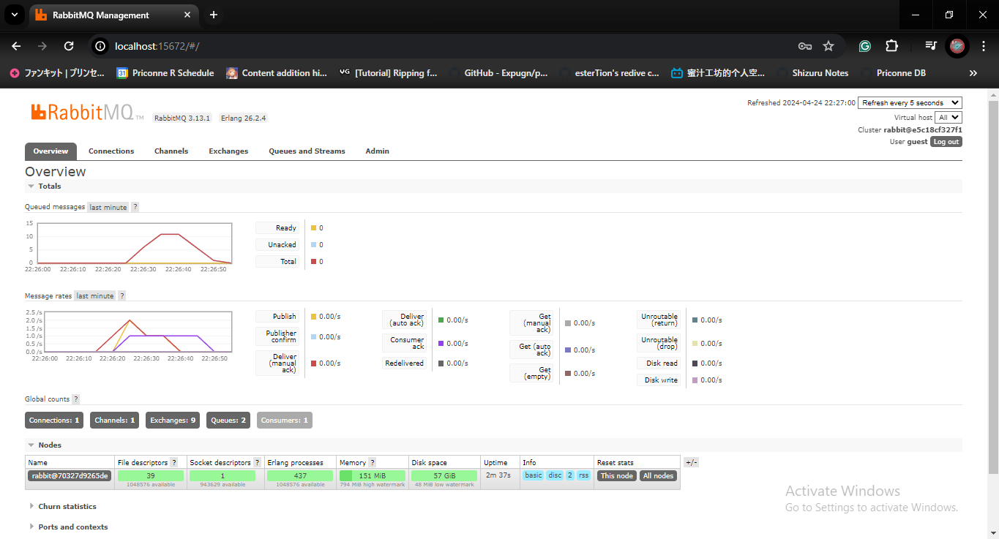
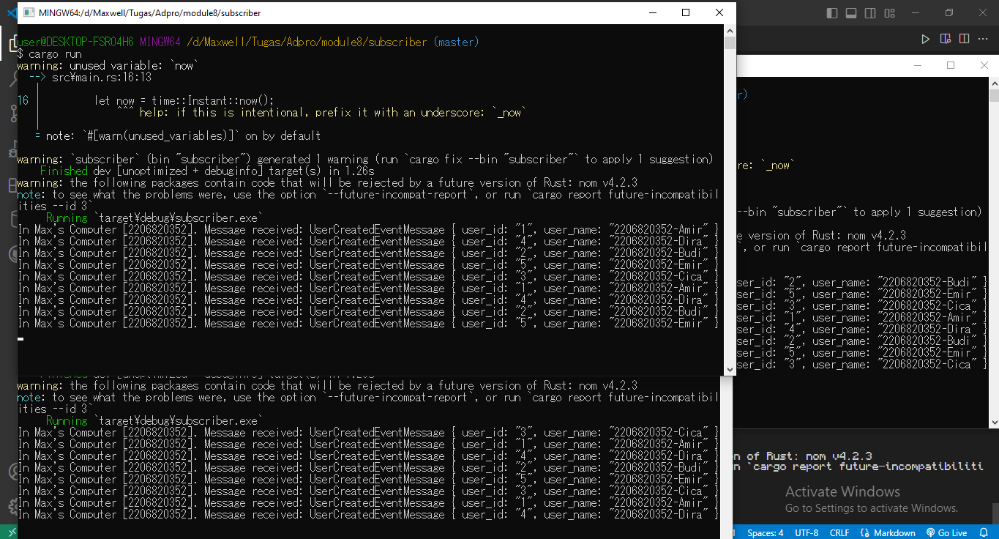
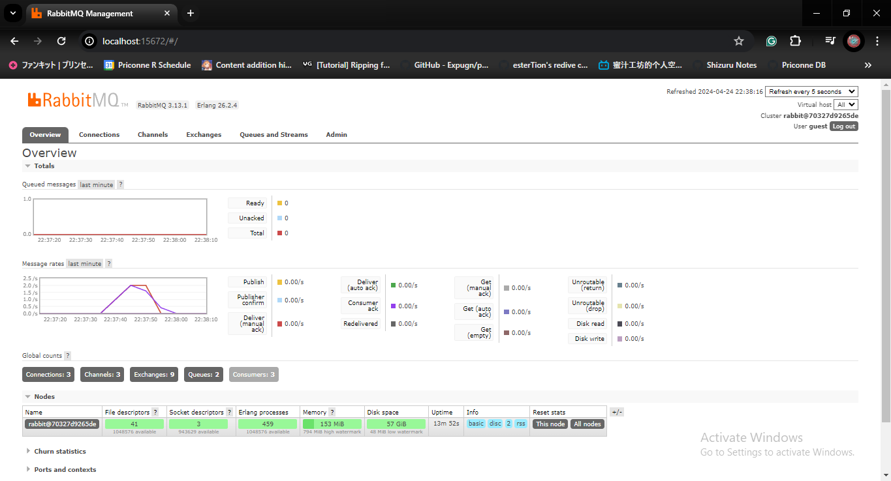

# Subscriber App

## Reflection
> What is `amqp`?

`amqp` adalah singkatan dari **Advanced Message Queuing Protocol**. Ini merupakan sebuah protokol untuk mengirim dan menerima suatu *message* dari berbagai servis ke servis-servis lain. *Message* yang dimaksud disini merupakan data yang dikirimkan melalui internet sebagai suatu *stream of bytes*. `amqp` juga merupakan protokol pada lapisan aplikasi, seperti layaknya `HTTP` dan `HTTPS`. Dalam penggunaan `amqp`, *message* yang diterima bisa dikirimkan dari satu poin ke poin yang lain, atau bisa juga seperti model *publisher* dan *subcsriber* yang akan dilakukan pada tutorial ini. 

> What does "guest:guest@localhost:5672" means? What is the first "guest", the second "guest", and what is "localhost:5672" for?

Pada uri "guest:guest@localhost:5672", `guest` yang pertama menandakan username dari akun yang akan digunakan untuk dihubungkan dengan sesi `amqp`. `guest` yang kedua menandakan password dari username yang digunakan. `localhost` menandakan bahwa sesi `amqp` yang akan disambungkan adalah sesi `amqp` yang berada pada mesin lokal saya. `5672` disini menandakan port dimana sesi `amqp` ini berjalan pada `localhost`. Secara keseluruhan, uri "guest:guest@localhost:5672" menandakan bahwa *subscriber* akan menyambungkan dirinya dengan sesi `amqp` yang berjalan di `localhost:5672` dan menggunakan username dan password `guest`.

## Images
Gambar yang memperlihatkan kondisi *chart* pertama yang memiliki *spike* ketika mengsimulasikan `subsriber` yang lambat dalam memproses data. Dapat dilihat bahwa terdapat sekitar 10 lebih *message* yang berada dalam *queue* pada suatu waktu selama beberapa detik lalu jumlah itu menurun. Ini terjadi karena `subscriber` membutuhkan waktu 10ms untuk memproses sebuah *message*, sehingga *message* menjadi menumpuk sementara di `rabbitmq` ketika `publisher` mem-*publish* banyak *event* dalam waktu singkat.

Gambar yang memperlihatkan 3 program `subscriber` yang menerima *message* dari `publisher` yang dijalankan beberapa kali.

Gambar yang memperlihatkan *chart* `rabbitmq`. Dapat dilihat bahwa *queued messages* tidak terlihat memiliki *spike* seperti ketika hanya ada 1 `subscriber` saja yang dijalankan. Hal ini dikarenakan *message* yang berada dalam *queue* akan dikirimkan ke salah satu `subscriber`, tidak ke semua `subscriber`, sehingga ketika sedang menunggu salah satu `subscriber` memproses data, `rabbitmq` bisa mengirimkan *message* berikutnya ke `subscriber` lain yang sudah selesai memproses data atau sedang dalam keadaan kosong. Hal ini juga tampak pada gambar sebelumnya karena setiap `subscriber` mendapat *message* dalam urutan yang berbeda-beda.

